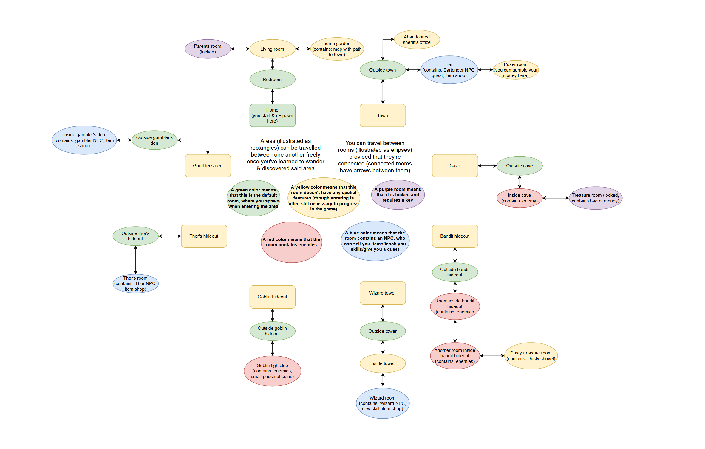

# Welcome to my text adventure!
by Aarni Haapaniemi, 788270
For course O1/programming 1, Aalto University

(walkthrough at the bottom)

# How does the game work?
You start the game by running TextUI.scala, in the folder "UI"
The player can explore areas and rooms inside areas, discorvering new people, and finding treasures.
The game has textual commands, which the player can use to move and interract with the world (inputting commands uccurs when you see ">>> " pop up. If you don't see this, the game isn't expectinga command, and you should just press enter.
In case a textual command is typed incorrectly, the game will do it's best to find a guess, and ask the user to confirm the guess.
eg. if the player types "/gtorom living room", the game will ask if they meant to type "/gotoroom" instead, which the player can confirm by inputting "y".
(Note: as the text correction works by string comparison and calculating the Levenstein distances between words, the computation when inputting a wrong word may be long, espetially for long words. On my machine, computing a guess for "/shorttest" takes 0.3 seconds, but it takes over a minute for "/thisisalongertest". You can turn off levenstein distance computation in "/settings")

# playing the game
As previously stated, you can move between areas and rooms inside areas. Rooms may contain interesting items, which you find by typing /exploreroom. This'll also show you connecting rooms which you may enter. It is recommended you do this to all rooms which you don't haven't visited yet. The game is won by completing the bartender's quest, and defeating the final boss. If you run out of lives, you lose the game.

# walkthrough
When first starting the game, you can input any name (inputting chuck norris will grant you an instant win)
After inputting your name, press enter until you get to the class selection screen.
You can select a class by inputting the number (1-4) and confirm it by inputting "y"
(the optimal strategy will vary depending on the character you choose). Also, this method will ship certain areas altogether. If you wish to explore them on your own, go right ahead.

Regarless of which character you chose, press enter once in order to type commands (you can type commands when ">>> " appears)
You can now type "/help" for a list of commands!
Typing "/exploreroom" will give a description of the items in the room, and the doors that are found there (doors lead to new rooms).

Then, type "/gotoroom living room", and "/gotoroom home garden" to get to the garden.
In the garden, there is an item named "map with path to town". Pick it up by typing "/pickup map with path to town"
The game then tells you that you've found the area called "town". Visit it by typing "/gotoarea town".

Once in the town, type "/gotoroom bar". There, you'll meet the bartender, who has a quest for you. He tells you that you need to bring him a golden shovel. A little weird, but okay.

If you're using the rich bastard class (or if you're very patient and a little lucky), go into the poker room by typing "/gotoroom poker room", and gamble until you have 5000 money. You are pretty much guaranteed (over 99% when using rich bastard, and ~95% otherwise) to eventually reach this amount of money by placing small bets (~10% of current money) and doubling down when the odds are in your favour. once you do, leave the poker room (input "y" twice). 

If you succeed in gambling, type "/wander" until you've the area thor's hideout.
Go to thor's hideout (/gotoarea thor's hideout), and enter his toom (/gotoroom thor's room). After reading the voicelines, type "/shop", and "/buy god potion (+100 of health, damage and defence)". exit the shop by inputting "n", and type "/drink god potion (+100 of health, damage and defence)". You now have the power of a god!

If you don't succeed, it is recommended that you get some money (monster rooms often contain money bags, which you can sell to merchants.).

type /wander until you discover the areas bandit hideout and wizard tower (if they aren't already discovered). Using this money, you should but potions and food from the wizard.

Then, go to the bandit hideout (/gotoarea bandit hideout), and then enter the next room (/gotoroom room inside hideout) and attack your enemies (input autoattack). Again, go to the next room (/gotoroom another room inside hideout), autoattack the enemies, and then enter the treasure room (/gotoroom dusty treasure room). Once in the treasure room, pick up the dustry shovel (/pickup dusty shovel). You can also pick up the treasure chest to sell later (/pickup almost empty treasure chest).
Following this, go to the wizard tower (/gotoarea wizard tower), and enther the wizard's room ("/gotoroom inside wizard tower" and "/gotoroom wizard room"). You've now learn to enchant, do /turnintogold dusty shovel to turn it into a golden shovel. 

Once you've got the golden shovel,  go to the bar ("/gotoarea town" and "/gotoroom bar"). You'll find that because you gave the bartender his shovel, he turns evil, and you have to fight him. Beat the bartender, and you win the game :)

Please note: I am not great at balancing games. It is technically possible to end up in a situation where winning the game is not possible (eg. by gambling all your money away and not having enough health/damage/resistance to beat the final boss. Although, this'll tach you a valuable lesson about gambling.)

